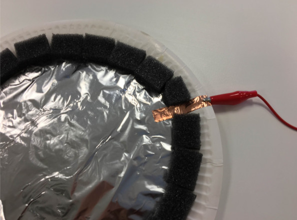
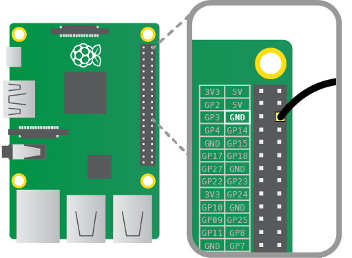
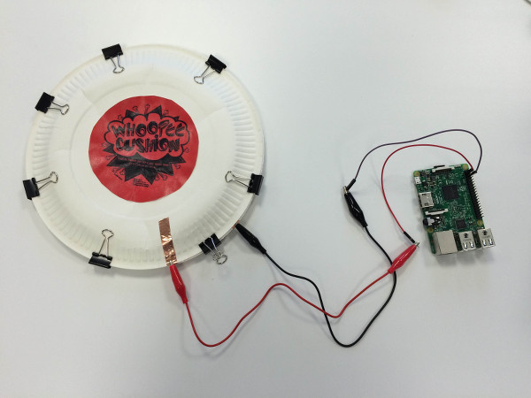

# Make a WhoopPi Cushion

In the bad old days before TV and computers, the most popular family entertainment was the whoopee cushion, a tooty balloon originally made from a pig’s bladder. The whoopee cushion would be inflated and hidden under grandad’s chair cushion. When he sat down, it would make a loud "PARP!" noise, causing him to jump into the air and making his false teeth fly out. It was the best thing ever (especially when the dog caught the teeth and ran about wearing them and grinning). This project brings the whoopee cushion up to date: there's no bladder and no need to blow it up. Thanks to the Raspberry Pi, you can also add whatever noises you want!

## Making the WhoopPi cushion
1. Cut a circle from the cardboard to fit the centre of the “eating” side of each paper plate. 
1. Tape or stick squares of foil onto the cardboard. These are your contacts: when they touch, they will make a circuit.
1. Using some copper tape, connect the foil to the edge of the plate. 
1. Chop the sponge up into cuboid chunks and glue them around the foil on one of the plates: this will stop the foil squares touching each other until someone sits on the plate. It should look something like this:

	

1. Put the two plates together so that the foil pieces are on the inside and facing each other. Offset the paper plates so that the copper tape sections are not touching. 
1. You now have a “cushion” made of two plates. You can tape the plates together, or you might choose to use bulldog or paper clips so that you can test that your cushion works correctly and easily debug any hardware problems.


## Connect the WhoopPi cushion to the Pi

1. Plug one header lead (it doesn’t matter which) onto a ground (GND) pin on the Pi:

	

	**Note**: if you have an older Raspberry Pi model you'll only have 26 pins but they have the same layout.

1. Plug the other wire onto GPIO pin 2:

	

1. Clip a crocodile clip cable to one of the paper plates' copper tape sections.

1. Then connect the other end of the crocodile clip cable to the male pin of one of the connected jumper wires. 

	

1. Repeat these last two steps to connect the other plate to your Raspberry Pi.

	Your setup should look something like this:

	
	

## Test the sound
That’s the hardware complete. Now for the software! We are going to use Python. Don’t worry if you haven't used it before: just follow the instructions and you will pick it up.
You will be using the command line to enter commands. To do this you will need to open a terminal window by clicking on the **terminal** icon: it looks like a computer screen, and is found three icons along from the menu button on your desktop. 

1. Connect the speaker to the Raspberry Pi using the sound jack port.
1. Create a new folder called whoopee by typing the following command in the terminal and pressing **enter** on the keyboard:

	```bash
    mkdir whoopee
    ```

1. Next, use the following command to enter the folder you have just created:

	``` bash
    cd whoopee
    ```
	We're going to need a sample sound file for this project so we'll use one from Sonic Pi.

1. Download a burp sample using the following command:

    ```bash
    wget http://rpf.io/burp -O burp.wav
    ```

1. Now test that you can play the sound file using `aplay` by typing:

	```bash
    aplay burp.wav
    ```
    
	You should hear it from the speakers or headphones connected to your Pi. If you can’t hear anything, make sure that your speakers are connected correctly. If this still doesn’t work, you'll need to change your audio configuration. 

	To switch audio to the headphone jack, return to the terminal window and type the following command:

	```bash
	amixer cset numid=3 1 
	```

1. If your Raspberry Pi is connected to the internet you could search for some suitable trumping sounds. They need to be in ‘wav’ format to work. Alternatively, you can [download our example sounds here](http://rpf.io/farts).

## Write a program in Python

1. Open Python 3 (IDLE) from the Programming menu and click on **File** and **New Window**. This will open a blank file. 
1. Click on **File** and **Save As** and name the file `whoopee.py`
1. Type the following code into your file:

	```python
	import os
	import random
	from time import sleep
	from gpiozero import Button
	```
	This part of the code pulls in all the libraries that you are going to use to write your program. 

1. Then, you'll need to use the Button class in your code. You'll have to tell it that the button is on pin 2. To do this, write the following code in your new file:

	```python
	button = Button(2)
	```

1. Now create a list of all your sound effects and store then inside a variable that you can call later on in your code:

	```python
	trumps = ['silly.wav', 'bean.wav', 'raspb.wav', 'wind.wav']
    ```
	In Python, square brackets are used to create a list. Each item in the list is separated by a comma. 

1. Once all the setup needed in the code is complete, you can move on to writing the part of the program that will make something happen when the button is pressed. Begin by creating a loop using `while True:`.
1. Then, add `button.wait_for_press()` inside the loop by indenting by four spaces. Each time around the loop, the computer waits for the button to be pressed.
1. On the next line, use the `random.choice` function to select a sound at random from the list you created earlier. That selected sound needs to be stored inside another variable which you can call parp! Type `parp = random.choice(trumps)`.
1. The next line will play the sound selected at random using `aplay`, which you used earlier to test your sounds. Type `os.system("aplay {0}".format(parp))`.
1. Finally, add `sleep(2)` to pause the program before it starts the loop again. 
1. Your code should look like this:
 
	```python
	while True:
        button.wait_for_press()
        parp = random.choice(trumps)
        os.system("aplay {0}".format(parp))
        sleep(2)
	```

1. Save the file by clicking on **File** and **Save**.

1. Test that your code works by clicking on **Run** and **Run Module**. Use your hand to push the top plate of your WhoopPi cushion down to make a connection between the tinfoil sheets and you should hear a fun sound. If it does not work first time, do not worry. Check your code through. Have you typed your code out **exactly** as you see it here?

## Setting it up

1. Carefully place your whoopee cushion in a spot where your victim will sit on it (obviously!), but not under a really heavy cushion where it will be squashed straight away. 
1. The tricky bit is setting up the Pi so that it can’t be seen: remember, you’ll need a plug socket to connect it to power, unless you are using a battery pack.
1. Run the program, and wait. Here's a hint: whistle tunelessly and look around at the ceiling. This will make you seem innocent, and will help to attract potential victims.

## What next?
- Record your own voice shouting, “Help! You’re sitting on me!”, and add this sound file to your program. 
- Record your parents when they are telling you off and put the WhooPi cushion under their pillow in bed with the new sample. Note: This may lead to loss of pocket money or worse, especially if you record the scene and put it on YouTube.
- Learn to make a [parent detector](https://www.raspberrypi.org/learning/parent-detector/) for your room. 
